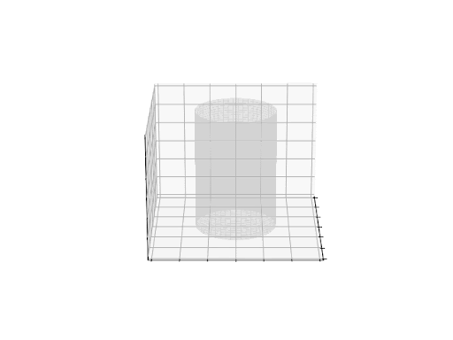

## About

DiffSimViz (Diffusion Simulator Visualizer) is a python toolbox CLI with the aim of providing intuitive visualizations of particle diffusion in different media/microstructure.

> _2D Examples:_  

> _3D Example_: 

## Inspiration

The brain is made up of water molecules and brain cells (axons, dendrites, and cell bodies) which are on a micron scale. The movement of these water molecules gives us some anatomical information about brain cells. Important for understanding diseased states and for improving our knowledge about human cognition. Diffusion MRI leverages the movement of these water molecules and thus, it can be difficult to understand for newcomers to the field, and they would benefit from simplified visuals which depict the diffusion process.

The use of such a visualizer will be didactic or for researchers to better understand what their diffusion MRI signal might look like in particular microstructural environments.

## Usage

Create and activate a Python virtual environment:
python -m venv venv

    python -m venv venv
    source venv/bin/activate
    # If on Windows:
    .\venv\Scripts\activate

Install Python dependencies:

    pip install -r requirements.txt

Run the program:

    python diffsimviz.py

### Arguments

    -mol, --numofmol: Number of molecules (default: 8)
    -steps, --steps: Number of steps (time steps) in the simulation (default: 30)
    -rad, --radius: Radius of stick that is horizontal before transformations (default: 0.2)
    -vrad, --vradius: Radius of stick that is vertical before transformations (default: 0.2)
    -theta: Angle in degrees used to rotate the sticks (default: 45)
    -delta: The value determining the "speed" of the Brownian motion.  The random variable
            of the position at time t, X(t), has a normal distribution whose mean is
            the position at time t=0 and whose variance is (delta^2)*t.
    -time: Total time for the simulation (default: 7)
    -sticks: Number of 'sticks', pairs of walls representing axons, fibres, and etc. to be included in the simulation (default: 2)

###Example command:

    python diffsimviz.py -mol 12 -steps 50 -rad 0.3 -vrad 0.25 -theta 60 -delta 0.5 -time 10 -sticks 3
